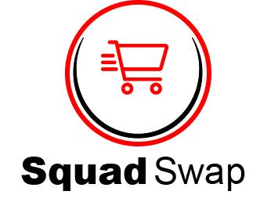

Squad Swap is an online marketplace where friends, family, and similiar-interest groups can buy and sell their used goods and interact with one another throughout the bidding/buying/bartering process. The main display features an image gallery of open items for sale. Users can interact with the gallery to get more details about the item and seller, and place bids on the item. Users also have the ability to leave reviews for the seller on their buying experience.

## Getting Started:
[The Deployed Project](https://squad-swap.netlify.app/)

[Our Planning Materials](https://trello.com/b/Rd7hKrHt/squad-swap)

[Our Backend Repo](https://github.com/egger0a6/squad-swap-api)

## Contributors 

[Jamie Ahmed](https://github.com/jamieahmed)

[Rob Reynolds](https://github.com/razorhollow)

[Zach Eggert](https://github.com/egger0a6)

## Screenshots

## Technologies Used

 
 
 

 

 

## Next Steps
- [ ] When creating a listing, a user will have the option to upload their own photo, or search for stock photography of the item to accompany it.
- [ ] A user will have the ability to save another user to their friends list.
- [ ] When a user is on the main page, there will be a toggle button, which filters listings to only those belonging to persons in the user's friends list.
- [ ] Buyers will have the ability to ask sellers questions regarding their listing